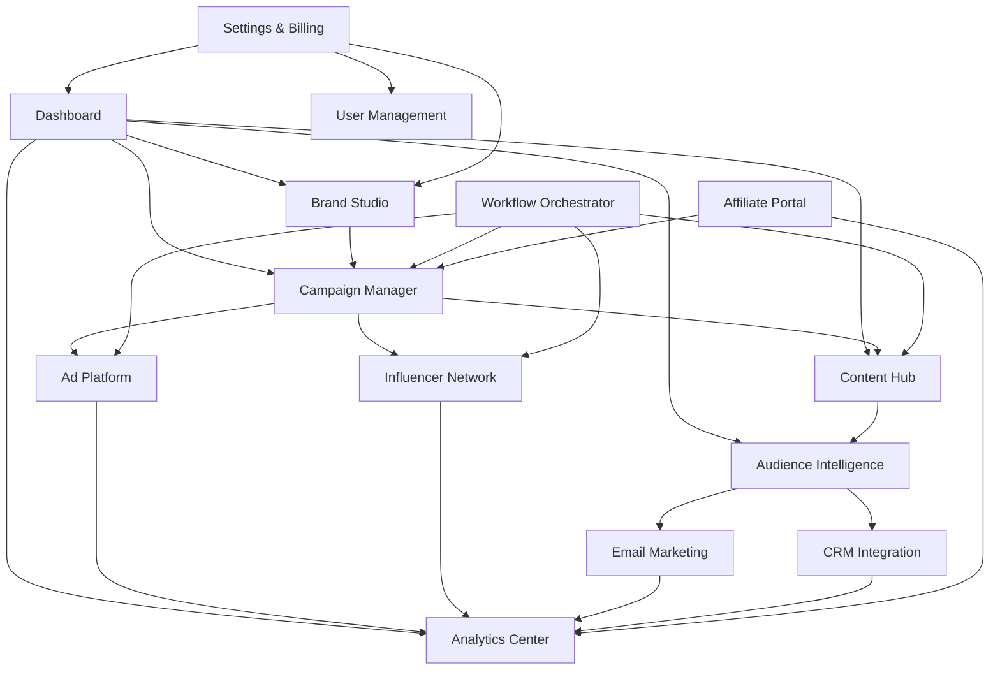

## 1. Product Overview

A comprehensive multi-tenant agentic marketing SaaS platform that automates entire marketing funnels using AI agents. The platform orchestrates branding, content creation, distribution, advertising, lead generation, and analytics across multiple channels while maintaining strict tenant isolation and enabling both individual workflow execution and combined campaign orchestration.

The product solves the problem of fragmented marketing tools by providing an integrated AI-powered solution that handles complete customer acquisition and retention workflows, enabling businesses to scale their marketing efforts with minimal manual intervention while maintaining brand consistency and performance optimization through continuous feedback loops.

## 2. Core Features

### 2.1 User Roles

| Role | Registration Method | Core Permissions |
|------|---------------------|------------------|
| Tenant Admin | Email registration + domain verification | Full tenant management, billing, user management, workflow configuration |
| Marketing Manager | Invited by Tenant Admin | Create and manage campaigns, approve workflows, access analytics |
| Content Creator | Invited by Tenant Admin | Create and edit content assets, manage content calendar |
| Affiliate Partner | Self-registration with approval | Access promotional materials, track commissions, view performance |
| Influencer | Application and approval process | View campaign briefs, submit deliverables, track payments |
| Viewer | Invited by Tenant Admin | Read-only access to reports and dashboards |

### 2.2 Feature Module

Our agentic marketing SaaS consists of the following main pages:

1. **Dashboard**: Overview of all marketing activities, KPIs, and agent status across workflows
2. **Brand Studio**: Brand positioning, tone guidelines, persona management, and visual identity
3. **Campaign Manager**: Multi-channel campaign creation, scheduling, and performance tracking
4. **Content Hub**: AI-powered content generation, asset management, and multi-format publishing
5. **Audience Intelligence**: Lead management, segmentation, and behavioral analytics
6. **Ad Platform**: Paid advertising campaign management with retargeting capabilities
7. **Influencer Network**: Influencer discovery, collaboration, and campaign management
8. **Affiliate Portal**: Partner management, commission tracking, and promotional tools
9. **Analytics Center**: Comprehensive reporting, attribution modeling, and optimization insights
10. **Workflow Orchestrator**: Visual workflow builder with approval checkpoints and automation rules
11. **Settings & Billing**: Tenant configuration, user management, integrations, and subscription management

### 2.3 Page Details

| Page Name | Module Name | Feature description |
|-----------|-------------|---------------------|
| Dashboard | Overview Cards | Display real-time KPIs including leads generated, conversion rates, campaign performance, and agent activity status with trend indicators |
| Dashboard | Agent Status Monitor | Show active AI agents, their current tasks, completion percentages, and any pending approvals or errors |
| Dashboard | Quick Actions | Provide shortcuts to create campaigns, generate content, view reports, and manage pending approvals |
| Brand Studio | Brand Core Builder | Configure brand positioning, mission, values, and unique selling propositions with AI-assisted refinement |
| Brand Studio | Tone & Voice Guidelines | Define communication style, formality level, and brand personality with example content generation |
| Brand Studio | Persona Manager | Create detailed buyer personas with demographics, psychographics, pain points, and content preferences |
| Brand Studio | Visual Identity | Upload brand assets, define color palettes, typography, and design guidelines for consistent content creation |
| Campaign Manager | Campaign Builder | Create multi-channel campaigns with objectives, budgets, timelines, and target audience selection |
| Campaign Manager | Workflow Orchestration | Configure agent workflows, set approval checkpoints, define trigger conditions and execution sequences |
| Campaign Manager | Performance Tracking | Monitor campaign metrics across all channels with attribution modeling and ROI calculations |
| Content Hub | AI Content Generator | Generate blog posts, social media content, videos, and ad copy using brand guidelines and target personas |
| Content Hub | Asset Library | Organize and manage all content assets with tagging, version control, and usage analytics |
| Content Hub | Multi-Channel Publisher | Schedule and publish content across websites, social platforms, email, and advertising networks |
| Content Hub | Content Calendar | Visual calendar view of scheduled content with drag-and-drop rescheduling and bulk operations |
| Audience Intelligence | Lead Capture Forms | Create and embed lead generation forms with progressive profiling and validation rules |
| Audience Intelligence | Lead Scoring | Configure scoring models based on behavior, demographics, and engagement patterns |
| Audience Intelligence | Segmentation Engine | Create dynamic audience segments based on attributes, behaviors, and lifecycle stages |
| Audience Intelligence | CRM Integration | Sync lead data with external CRM systems and track customer journey touchpoints |
| Ad Platform | Campaign Creation | Build advertising campaigns for Google, Facebook, LinkedIn with AI-optimized targeting |
| Ad Platform | Budget Management | Set and monitor advertising budgets with automated bid optimization and spend alerts |
| Ad Platform | Creative Testing | A/B test ad creatives with automatic winner selection and performance optimization |
| Ad Platform | Retargeting Setup | Configure retargeting pixels, audience exclusions, and sequential messaging campaigns |
| Influencer Network | Influencer Discovery | Search and filter influencers by audience demographics, engagement rates, and content relevance |
| Influencer Network | Campaign Collaboration | Create campaign briefs, manage applications, and track deliverable submissions |
| Influencer Network | Performance Analytics | Monitor influencer campaign reach, engagement, and conversion attribution |
| Influencer Network | Contract Management | Generate and manage influencer contracts with deliverable requirements and payment terms |
| Affiliate Portal | Partner Dashboard | Provide affiliates with performance metrics, commission tracking, and promotional materials |
| Affiliate Portal | Link Generator | Create trackable affiliate links with custom parameters and landing page optimization |
| Affiliate Portal | Commission Rules | Configure commission structures, tier requirements, and payout schedules |
| Affiliate Portal | Fraud Detection | Monitor for suspicious activity and implement quality controls for affiliate conversions |
| Analytics Center | Real-time Reporting | Generate customizable reports with real-time data updates and automated scheduling |
| Analytics Center | Attribution Modeling | Configure multi-touch attribution models to understand customer journey impact |
| Analytics Center | Performance Insights | Receive AI-powered recommendations for optimization based on data patterns |
| Analytics Center | Custom Dashboards | Build personalized dashboards with drag-and-drop widgets and data visualization |
| Workflow Orchestrator | Visual Builder | Create workflows using drag-and-drop interface with conditional logic and branching |
| Workflow Orchestrator | Approval Management | Configure approval workflows with role-based permissions and notification systems |
| Workflow Orchestrator | Automation Rules | Set up trigger-based automation with custom conditions and action sequences |
| Workflow Orchestrator | Integration Hub | Connect with external tools and services through API integrations and webhooks |
| Settings & Billing | Tenant Configuration | Manage tenant settings, custom domains, branding, and system preferences |
| Settings & Billing | User Management | Invite team members, assign roles, and configure permission levels |
| Settings & Billing | Integration Settings | Configure third-party integrations, API keys, and webhook endpoints |
| Settings & Billing | Subscription Management | View billing history, upgrade plans, and manage payment methods |

## 3. Core Process

### Tenant Onboarding Flow
1. User registers with email and creates tenant account
2. System generates unique tenant ID and isolated workspace
3. User configures brand guidelines and target personas
4. User sets up integrations and connects existing tools
5. User creates first campaign and activates AI agents
6. System begins automated marketing orchestration

### Campaign Creation Flow
1. Marketing Manager creates campaign with objectives and budget
2. Branding Agent ensures content aligns with brand guidelines
3. Content Creation Agent generates multi-format assets
4. Campaign Manager orchestrates distribution across channels
5. Analytics Agent monitors performance and optimizes
6. Human approval required for major budget or strategy changes

### Lead Generation Flow
1. Landing Page Agent creates conversion-optimized pages
2. Content Agent drives traffic through valuable content
3. Ad Campaign Manager targets qualified prospects
4. Lead capture forms collect visitor information
5. Email Marketing Agent nurtures leads through sequences
6. CRM integration tracks full customer journey

### Content Creation Flow
1. Strategy Agent analyzes market and competitor data
2. Topic Mapper identifies high-performing content themes
3. Asset Generator creates blog posts, videos, and social content
4. QA Agent reviews content for brand compliance
5. Publishing Agent distributes across all channels
6. Performance data feeds back for optimization

## 4. User Interface Design

### 4.1 Design Style
- **Primary Colors**: Deep purple (#6B46C1) for primary actions, emerald (#10B981) for success states, slate (#64748B) for secondary elements
- **Secondary Colors**: Gradient backgrounds from purple to blue for hero sections, white backgrounds for content areas
- **Button Style**: Rounded corners (8px radius), subtle shadows on hover, clear hover states with color transitions
- **Typography**: Inter font family with hierarchical sizing - 32px for headings, 16px for body text, 14px for captions
- **Layout Style**: Card-based design with consistent spacing (24px grid system), top navigation with sidebar for contextual actions
- **Icon Style**: Line icons from Heroicons with consistent 1.5px stroke width, purple primary color scheme

### 4.2 Page Design Overview

| Page Name | Module Name | UI Elements |
|-----------|-------------|-------------|
| Dashboard | Overview Cards | Purple gradient background cards with white text, circular progress indicators, trend arrows in emerald green for positive metrics |
| Dashboard | Agent Status | Live status indicators with pulsing animations, progress bars showing task completion, error states in red with alert icons |
| Brand Studio | Brand Builder | Multi-step form with progress indicator, rich text editor for descriptions, color picker with brand palette preview |
| Campaign Manager | Campaign List | Data table with sorting and filtering, status badges with color coding, quick action buttons with icon tooltips |
| Content Hub | Asset Gallery | Masonry grid layout for visual content, hover effects showing metadata, drag-and-drop upload zones with file type indicators |
| Analytics Center | Charts | Interactive charts with zoom functionality, comparison toggles, export options in top-right corner of chart containers |
| Workflow Orchestrator | Visual Builder | Drag-and-drop canvas with snap-to-grid functionality, connection lines showing data flow, node status indicators |

### 4.3 Responsiveness
- Desktop-first design approach with mobile optimization
- Responsive breakpoints: 320px (mobile), 768px (tablet), 1024px (desktop), 1440px (wide)
- Touch-friendly interactions with minimum 44px tap targets on mobile
- Collapsible navigation for mobile devices with hamburger menu
- Card-based layouts that stack vertically on mobile devices
- Horizontal scrolling for data tables on smaller screens

### 4.4 3D Scene Guidance
- **Environment**: Modern office environment with soft lighting for professional feel
- **Lighting**: Three-point lighting setup with key light at 45° angle, fill light for shadow reduction, rim light for subject separation
- **Camera**: 16:9 aspect ratio with smooth transitions between sections, parallax scrolling effects for depth
- **Composition**: Rule of thirds for hero sections, leading lines guiding user attention to CTAs
- **Animation**: Subtle hover animations (200ms ease-in-out), loading skeletons for data fetching, smooth page transitions
- **Post-processing**: Subtle depth of field for focus areas, mild bloom effect for highlights, tone mapping for consistent colors

## 5. Production Requirements

### Scalability
- Multi-tenant architecture with strict data isolation
- Horizontal scaling for AI agent processing
- Event-driven architecture with message queues
- Database partitioning for analytics data
- CDN integration for asset delivery

### Security
- End-to-end encryption for data transmission
- Role-based access control with granular permissions
- API rate limiting and DDoS protection
- Regular security audits and penetration testing
- GDPR compliance with data portability and deletion

### Performance
- Sub-second page load times for dashboard
- Real-time data updates using WebSocket connections
- Optimized database queries with proper indexing
- Caching strategies for frequently accessed data
- Lazy loading for heavy content components

### Reliability
- 99.9% uptime SLA with redundancy
- Automated backup and disaster recovery
- Health monitoring and alerting systems
- Graceful degradation for service failures
- Comprehensive logging and audit trails