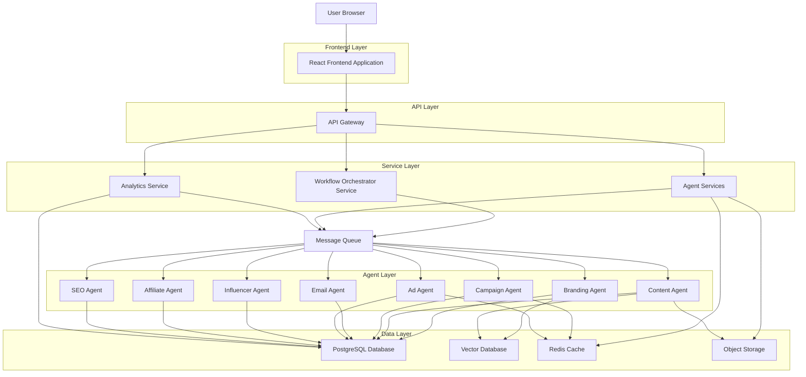
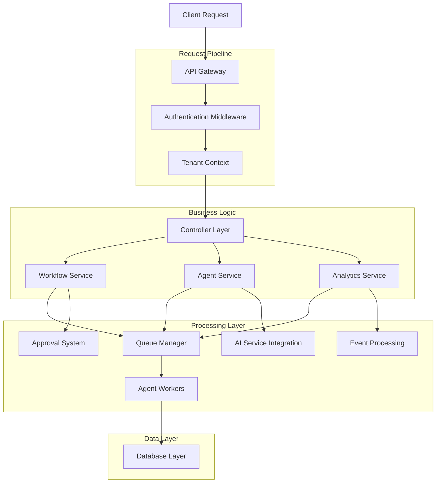
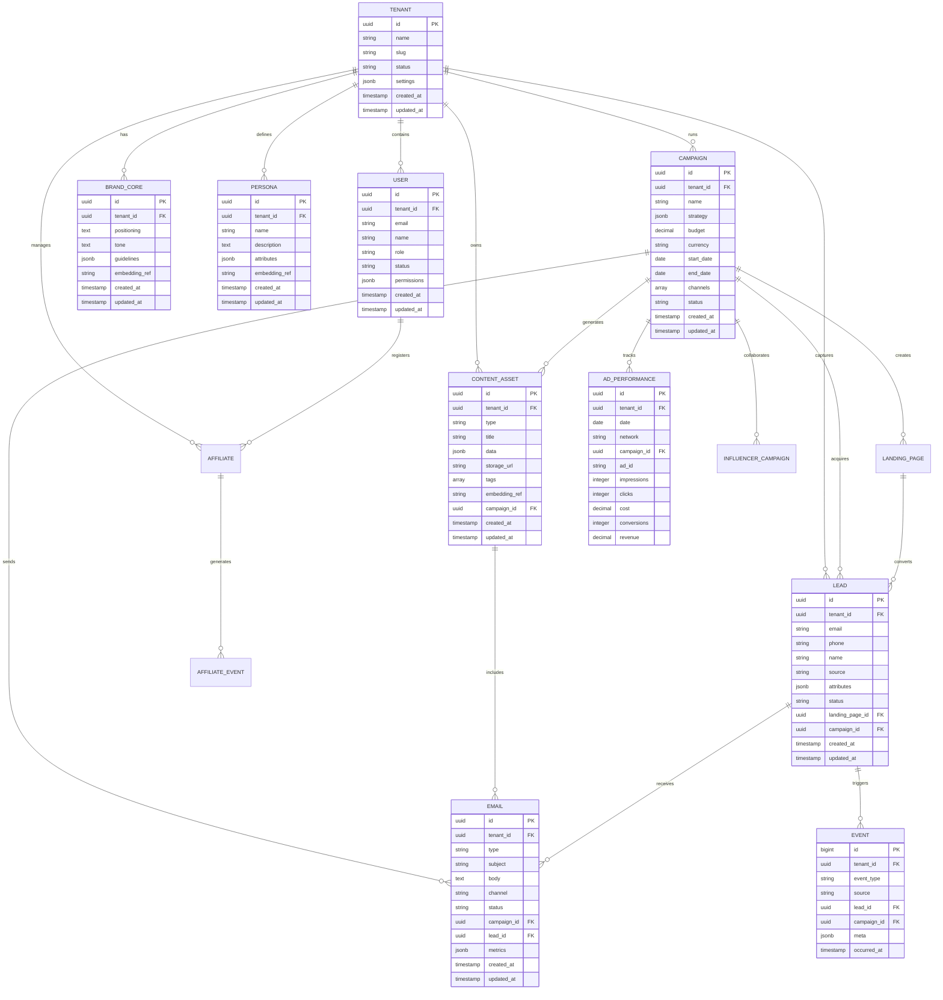

## 1. Architecture Design



## 2. Technology Description

- **Frontend**: React@18 + TypeScript + TailwindCSS@3 + Vite
- **Initialization Tool**: vite-init
- **Backend**: Node.js@20 + Express@4 + TypeScript
- **Database**: PostgreSQL@15 (primary) + Redis@7 (cache/queues) + Pinecone (vector DB via environment)
- **Message Queue**: Redis Streams / Bull Queue
- **Authentication**: Supabase Auth with JWT tokens
- **File Storage**: Supabase Storage / AWS S3
- **Real-time**: Socket.io for live updates
- **AI/ML**: OpenAI GPT-4, Claude, Stable Diffusion APIs
- **Analytics**: Custom event tracking with partitioned tables

## 3. Route Definitions

| Route | Purpose |
|-------|---------|
| / | Dashboard with overview and KPIs |
| /auth/* | Authentication pages (login, register, reset) |
| /brand-studio | Brand management and guidelines |
| /campaigns | Campaign creation and management |
| /campaigns/:id | Individual campaign details and analytics |
| /content | Content asset library and creation |
| /content/create | AI content generation interface |
| /audience | Lead and audience management |
| /audience/leads | Lead database with segmentation |
| /ads | Paid advertising campaign management |
| /influencers | Influencer discovery and campaigns |
| /affiliates | Affiliate program management |
| /analytics | Comprehensive reporting and insights |
| /workflows | Visual workflow builder |
| /workflows/:id | Specific workflow configuration |
| /settings/tenant | Tenant configuration and billing |
| /settings/users | User and role management |
| /settings/integrations | Third-party integrations |
| /api/* | REST API endpoints |
| /api-docs | API documentation |

## 4. API Definitions

### 4.1 Authentication APIs

```
POST /api/auth/register
```

Request:
| Param Name | Param Type | isRequired | Description |
|------------|------------|------------|-------------|
| email | string | true | User email address |
| password | string | true | Password (min 8 characters) |
| name | string | true | Full name |
| tenant_name | string | true | Company/tenant name |

Response:
| Param Name | Param Type | Description |
|------------|------------|-------------|
| user | object | User profile data |
| tenant | object | Tenant information |
| token | string | JWT access token |

### 4.2 Campaign APIs

```
POST /api/campaigns
```

Request:
| Param Name | Param Type | isRequired | Description |
|------------|------------|------------|-------------|
| tenant_id | string | true | Tenant identifier |
| name | string | true | Campaign name |
| strategy | object | false | Campaign strategy configuration |
| budget | number | true | Total campaign budget |
| currency | string | true | Currency code (USD, EUR, etc.) |
| start_date | string | true | Campaign start date |
| end_date | string | true | Campaign end date |
| channels | array | true | Selected channels ["email", "social", "ads"] |

```
GET /api/campaigns/:id/analytics
```

Response:
| Param Name | Param Type | Description |
|------------|------------|-------------|
| campaign_id | string | Campaign identifier |
| metrics | object | Performance metrics |
| attribution | object | Attribution data |
| recommendations | array | AI optimization suggestions |

### 4.3 Content APIs

```
POST /api/content/generate
```

Request:
| Param Name | Param Type | isRequired | Description |
|------------|------------|------------|-------------|
| tenant_id | string | true | Tenant identifier |
| type | string | true | Content type (blog, social, ad, email) |
| topic | string | true | Content topic/theme |
| persona_id | string | false | Target persona identifier |
| brand_guidelines | object | false | Brand voice and style guidelines |
| keywords | array | false | SEO keywords to include |

### 4.4 Lead APIs

```
POST /api/leads/capture
```

Request:
| Param Name | Param Type | isRequired | Description |
|------------|------------|------------|-------------|
| tenant_id | string | true | Tenant identifier |
| email | string | true | Lead email address |
| name | string | false | Lead name |
| phone | string | false | Phone number |
| source | string | true | Lead source (landing_page, ad, etc.) |
| attributes | object | false | Additional lead data |
| campaign_id | string | false | Associated campaign |

### 4.5 Workflow APIs

```
POST /api/workflows/execute
```

Request:
| Param Name | Param Type | isRequired | Description |
|------------|------------|------------|-------------|
| tenant_id | string | true | Tenant identifier |
| workflow_id | string | true | Workflow configuration |
| trigger_data | object | false | Trigger-specific data |
| approval_required | boolean | false | Require human approval |

## 5. Server Architecture Diagram



## 6. Data Model

### 6.1 Entity Relationship Diagram



### 6.2 Data Definition Language

```sql
-- Enhanced tenants table with billing and limits
CREATE TABLE tenants (
    id UUID PRIMARY KEY DEFAULT gen_random_uuid(),
    name VARCHAR(255) NOT NULL,
    slug VARCHAR(100) UNIQUE NOT NULL,
    status VARCHAR(20) NOT NULL DEFAULT 'active',
    plan VARCHAR(50) NOT NULL DEFAULT 'starter',
    settings JSONB DEFAULT '{}',
    usage_limits JSONB DEFAULT '{}',
    billing_info JSONB DEFAULT '{}',
    created_at TIMESTAMP WITH TIME ZONE DEFAULT NOW(),
    updated_at TIMESTAMP WITH TIME ZONE DEFAULT NOW()
);

-- Enhanced users table with permissions
CREATE TABLE users (
    id UUID PRIMARY KEY DEFAULT gen_random_uuid(),
    tenant_id UUID NOT NULL REFERENCES tenants(id) ON DELETE CASCADE,
    email VARCHAR(255) NOT NULL,
    name VARCHAR(255) NOT NULL,
    role VARCHAR(50) NOT NULL DEFAULT 'member',
    status VARCHAR(20) NOT NULL DEFAULT 'active',
    permissions JSONB DEFAULT '{}',
    last_login_at TIMESTAMP WITH TIME ZONE,
    created_at TIMESTAMP WITH TIME ZONE DEFAULT NOW(),
    updated_at TIMESTAMP WITH TIME ZONE DEFAULT NOW(),
    UNIQUE(tenant_id, email)
);

-- Workflow execution tracking
CREATE TABLE workflow_executions (
    id UUID PRIMARY KEY DEFAULT gen_random_uuid(),
    tenant_id UUID NOT NULL REFERENCES tenants(id) ON DELETE CASCADE,
    workflow_type VARCHAR(100) NOT NULL,
    campaign_id UUID REFERENCES campaigns(id) ON DELETE SET NULL,
    status VARCHAR(50) NOT NULL DEFAULT 'pending',
    trigger_data JSONB DEFAULT '{}',
    execution_log JSONB DEFAULT '{}',
    approval_status VARCHAR(50) DEFAULT 'not_required',
    approved_by UUID REFERENCES users(id) ON DELETE SET NULL,
    approved_at TIMESTAMP WITH TIME ZONE,
    started_at TIMESTAMP WITH TIME ZONE,
    completed_at TIMESTAMP WITH TIME ZONE,
    created_at TIMESTAMP WITH TIME ZONE DEFAULT NOW(),
    updated_at TIMESTAMP WITH TIME ZONE DEFAULT NOW()
);

-- Agent task queue
CREATE TABLE agent_tasks (
    id UUID PRIMARY KEY DEFAULT gen_random_uuid(),
    tenant_id UUID NOT NULL REFERENCES tenants(id) ON DELETE CASCADE,
    workflow_execution_id UUID REFERENCES workflow_executions(id) ON DELETE CASCADE,
    agent_type VARCHAR(100) NOT NULL,
    task_type VARCHAR(100) NOT NULL,
    priority INTEGER DEFAULT 5,
    status VARCHAR(50) NOT NULL DEFAULT 'queued',
    input_data JSONB DEFAULT '{}',
    output_data JSONB DEFAULT '{}',
    error_message TEXT,
    retry_count INTEGER DEFAULT 0,
    max_retries INTEGER DEFAULT 3,
    queued_at TIMESTAMP WITH TIME ZONE DEFAULT NOW(),
    started_at TIMESTAMP WITH TIME ZONE,
    completed_at TIMESTAMP WITH TIME ZONE,
    created_at TIMESTAMP WITH TIME ZONE DEFAULT NOW(),
    updated_at TIMESTAMP WITH TIME ZONE DEFAULT NOW()
);

-- Vector embeddings for AI processing
CREATE TABLE vector_embeddings (
    id UUID PRIMARY KEY DEFAULT gen_random_uuid(),
    tenant_id UUID NOT NULL REFERENCES tenants(id) ON DELETE CASCADE,
    entity_type VARCHAR(100) NOT NULL,
    entity_id UUID NOT NULL,
    embedding_id VARCHAR(255) NOT NULL,
    content_hash VARCHAR(64) NOT NULL,
    metadata JSONB DEFAULT '{}',
    created_at TIMESTAMP WITH TIME ZONE DEFAULT NOW(),
    UNIQUE(tenant_id, entity_type, entity_id)
);

-- Approval audit trail
CREATE TABLE approval_history (
    id UUID PRIMARY KEY DEFAULT gen_random_uuid(),
    tenant_id UUID NOT NULL REFERENCES tenants(id) ON DELETE CASCADE,
    workflow_execution_id UUID REFERENCES workflow_executions(id) ON DELETE CASCADE,
    approver_id UUID NOT NULL REFERENCES users(id) ON DELETE CASCADE,
    approval_type VARCHAR(100) NOT NULL,
    decision VARCHAR(50) NOT NULL,
    comments TEXT,
    created_at TIMESTAMP WITH TIME ZONE DEFAULT NOW()
);

-- Performance indexes
CREATE INDEX idx_tenants_status ON tenants(status);
CREATE INDEX idx_tenants_plan ON tenants(plan);
CREATE INDEX idx_users_tenant_role_status ON users(tenant_id, role, status);
CREATE INDEX idx_workflow_executions_tenant_status ON workflow_executions(tenant_id, status);
CREATE INDEX idx_workflow_executions_campaign ON workflow_executions(campaign_id);
CREATE INDEX idx_agent_tasks_tenant_status ON agent_tasks(tenant_id, status);
CREATE INDEX idx_agent_tasks_workflow_execution ON agent_tasks(workflow_execution_id);
CREATE INDEX idx_agent_tasks_priority ON agent_tasks(priority DESC, created_at);
CREATE INDEX idx_vector_embeddings_tenant_type ON vector_embeddings(tenant_id, entity_type);
CREATE INDEX idx_approval_history_workflow ON approval_history(workflow_execution_id);

-- Row Level Security
ALTER TABLE tenants ENABLE ROW LEVEL SECURITY;
ALTER TABLE users ENABLE ROW LEVEL SECURITY;
ALTER TABLE workflow_executions ENABLE ROW LEVEL SECURITY;
ALTER TABLE agent_tasks ENABLE ROW LEVEL SECURITY;
ALTER TABLE vector_embeddings ENABLE ROW LEVEL SECURITY;
ALTER TABLE approval_history ENABLE ROW LEVEL SECURITY;

-- RLS Policies
CREATE POLICY tenant_isolation ON tenants USING (id = current_setting('app.tenant_id', true)::uuid);
CREATE POLICY user_tenant_isolation ON users USING (tenant_id = current_setting('app.tenant_id', true)::uuid);
CREATE POLICY workflow_tenant_isolation ON workflow_executions USING (tenant_id = current_setting('app.tenant_id', true)::uuid);
CREATE POLICY task_tenant_isolation ON agent_tasks USING (tenant_id = current_setting('app.tenant_id', true)::uuid);
CREATE POLICY vector_tenant_isolation ON vector_embeddings USING (tenant_id = current_setting('app.tenant_id', true)::uuid);
CREATE POLICY approval_tenant_isolation ON approval_history USING (tenant_id = current_setting('app.tenant_id', true)::uuid);

-- Grant permissions
GRANT SELECT ON tenants TO anon;
GRANT ALL PRIVILEGES ON tenants TO authenticated;
GRANT SELECT ON users TO anon;
GRANT ALL PRIVILEGES ON users TO authenticated;
GRANT SELECT ON workflow_executions TO anon;
GRANT ALL PRIVILEGES ON workflow_executions TO authenticated;
GRANT SELECT ON agent_tasks TO anon;
GRANT ALL PRIVILEGES ON agent_tasks TO authenticated;
GRANT SELECT ON vector_embeddings TO anon;
GRANT ALL PRIVILEGES ON vector_embeddings TO authenticated;
GRANT SELECT ON approval_history TO anon;
GRANT ALL PRIVILEGES ON approval_history TO authenticated;
```

## 7. Microservices Architecture

### 7.1 Service Components

**API Gateway Service**
- Handles authentication and authorization
- Rate limiting and request validation
- Request routing to appropriate services
- Response aggregation and caching

**Workflow Orchestrator Service**
- Manages workflow execution lifecycle
- Handles approval checkpoints
- Coordinates agent task distribution
- Manages error handling and retries

**Agent Services (Individual Microservices)**
- Branding Agent: Brand analysis and guideline generation
- Content Agent: Multi-format content creation
- Campaign Agent: Campaign orchestration and optimization
- Email Agent: Email sequence management and delivery
- Ad Agent: Paid advertising management and optimization
- Influencer Agent: Influencer discovery and campaign management
- Affiliate Agent: Affiliate program management and tracking
- SEO Agent: Search engine optimization and content optimization

**Analytics Service**
- Event ingestion and processing
- Real-time metric calculation
- Attribution modeling
- Report generation and distribution

### 7.2 Communication Patterns

**Synchronous Communication**
- REST APIs for client-server communication
- gRPC for inter-service communication
- GraphQL for complex data queries

**Asynchronous Communication**
- Redis Streams for event streaming
- Message queues for task distribution
- Webhooks for external integrations
- Pub/Sub for real-time updates

## 8. Security Architecture

### 8.1 Authentication & Authorization
- JWT-based authentication with refresh tokens
- Multi-factor authentication support
- Role-based access control (RBAC)
- API key management for integrations
- OAuth 2.0 for third-party integrations

### 8.2 Data Security
- Encryption at rest for sensitive data
- TLS 1.3 for data in transit
- Database encryption with tenant isolation
- Secure key management with rotation
- Regular security audits and penetration testing

### 8.3 Compliance
- GDPR compliance with data portability
- CCPA compliance for California residents
- SOC 2 Type II certification
- ISO 27001 information security standard
- Regular compliance audits and reporting

## 9. Deployment Architecture

### 9.1 Infrastructure
- Kubernetes for container orchestration
- Docker containers for service isolation
- Load balancers for traffic distribution
- CDN for static asset delivery
- Multi-region deployment for global availability

### 9.2 Monitoring & Observability
- Prometheus for metrics collection
- Grafana for visualization and alerting
- ELK stack for log aggregation
- Jaeger for distributed tracing
- Custom dashboards for business metrics

### 9.3 Scaling Strategy
- Horizontal pod autoscaling based on CPU/memory
- Database read replicas for query optimization
- Caching layers for frequently accessed data
- Queue-based processing for background tasks
- Event-driven architecture for loose coupling

This technical architecture provides a robust, scalable foundation for the multi-tenant agentic marketing SaaS platform with comprehensive support for individual workflows and combined campaign orchestration.